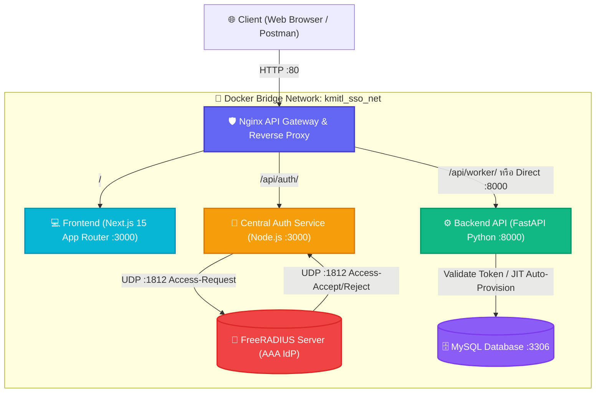
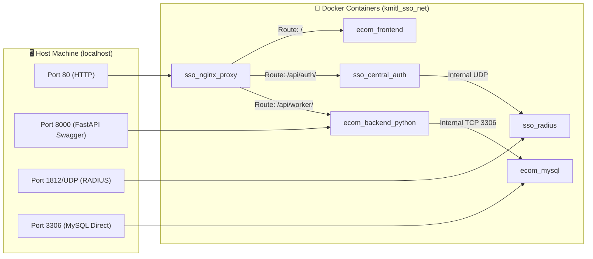
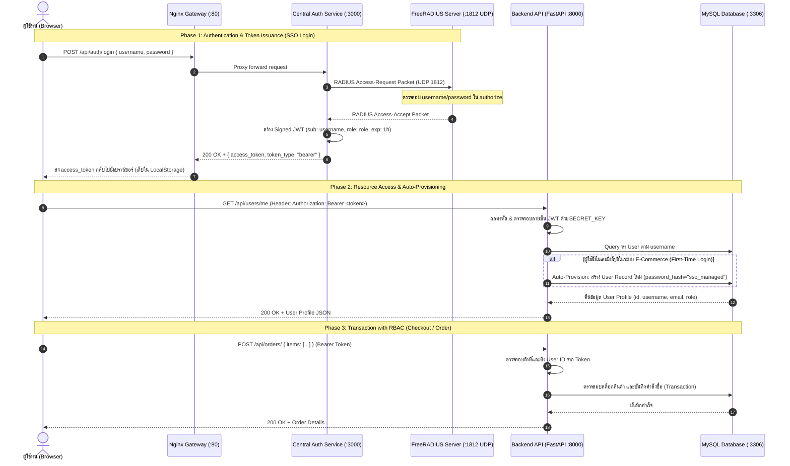

# 🛡️ Single Sign-On (SSO) Central Authentication & E-Commerce Platform
> **Cybersecurity LAB 6: Centralized Identity & Access Management (IAM) with FreeRADIUS, Microservices, and Docker**

---

## 📑 สารบัญ (Table of Contents)
1. [ภาพรวมของระบบและหลักการความปลอดภัย (System Overview & Security Principles)](#1-ภาพรวมของระบบและหลักการความปลอดภัย)
2. [สถาปัตยกรรมระบบ (System Architecture & Block Diagrams)](#2-สถาปัตยกรรมระบบ-system-architecture--block-diagrams)
3. [การทำงานของ SSO ที่ถูกต้อง 100% (SSO & Token Mechanism Deep-Dive)](#3-การทำงานของ-sso-ที่ถูกต้อง-100)
4. [การทำงานของ FreeRADIUS Server และ Central Auth API](#4-การทำงานของ-freeradius-server-และ-central-auth-api)
5. [โครงสร้างและการจัดการ Docker Multi-Container](#5-โครงสร้างและการจัดการ-docker-multi-container)
6. [วิธีการตรวจสอบและทดสอบระบบทุกขั้นตอน (Step-by-Step Verification)](#6-วิธีการตรวจสอบและทดสอบระบบทุกขั้นตอน-step-by-step-verification)
7. [Demo การทำงานของ Web Application (Frontend & User Journey)](#7-demo-การทำงานของ-web-application-frontend--user-journey)
8. [เครื่องมือและเทคโนโลยีทั้งหมดที่ใช้ (Tools & Tech Stack)](#8-เครื่องมือและเทคโนโลยีทั้งหมดที่ใช้-tools--tech-stack)
9. [คู่มือการติดตั้งและการรันระบบ (Quickstart & Deployment Guide)](#9-คู่มือการติดตั้งและการรันระบบ-quickstart--deployment-guide)

---

## 1. ภาพรวมของระบบและหลักการความปลอดภัย

โครงการนี้เป็นการพัฒนาระบบพาณิชย์อิเล็กทรอนิกส์ (E-Commerce Platform) ที่ผสานระบบ **Single Sign-On (SSO)** เพื่อยืนยันตัวตนของผู้ใช้งานผ่านเซิร์ฟเวอร์ **FreeRADIUS** จำลองระบบยืนยันตัวตนกลางระดับองค์กร (เช่น ระบบบัญชีนักศึกษา/บุคลากรของมหาวิทยาลัย)

```
┌─────────────────────────────────────────────────────────────────────────────┐
│                           SECURITY CORE PRINCIPLES                          │
├─────────────────────────────────────────────────────────────────────────────┤
│ 1. Single Source of Truth: รหัสผ่านถูกเก็บและยืนยันที่ FreeRADIUS ที่เดียว   │
│ 2. Zero Credential Exposure: MySQL ของร้านค้า ไม่มีการเก็บรหัสผ่านผู้ใช้     │
│ 3. Just-In-Time (JIT) Provisioning: สร้างบัญชีในร้านค้าอัตโนมัติเมื่อ SSO ผ่าน │
│ 4. Stateless Token Delegation: ยืนยันสิทธิ์ผ่าน Signed JWT (HS256)           │
│ 5. Network Isolation: แต่ละ Service สื่อสารผ่าน Docker Internal Network    │
└─────────────────────────────────────────────────────────────────────────────┘
```

### ทำไมระบบนี้ถึงถูกต้องตามหลัก Single Sign-On (SSO) 100%:
* **การแยก Identity Provider (IdP) ออกจาก Resource Server**: ฝั่ง E-Commerce Backend (FastAPI) และ Database (MySQL) ไม่มีสิทธิ์รับรู้หรือเก็บรหัสผ่านของผู้ใช้เลย (แม้กระทั่งรหัสผ่านที่ถูก Hash)
* **Central Authentication Bridge**: ระบบมี `central-auth` (Node.js) ทำหน้าที่เป็น Gateway เชื่อมต่อ Protocol **RADIUS (UDP)** แปลงผลการตรวจสอบเป็น **Standard JWT Bearer Token (JSON Web Token)**
* **Auto-Provisioning**: เมื่อผู้ใช้ที่ผ่านการยืนยันจาก FreeRADIUS เรียกใช้งาน API ของระบบ E-Commerce เป็นครั้งแรก ระบบจะทำการสร้าง Profile ในฐานข้อมูลร้านค้าให้อัตโนมัติ โดยอ้างอิงจาก `sub` (Username) และ `role` ใน Token Payload

---

## 2. สถาปัตยกรรมระบบ (System Architecture & Block Diagrams)

### 2.1 High-Level Architecture Diagram
แผนภาพแสดงสถาปัตยกรรมระดับภาพรวมของ Microservices และทิศทางการรับส่งข้อมูลผ่าน **Nginx Reverse Proxy / API Gateway**:



### 2.2 Docker Port Binding & Network Routing Diagram
แผนภาพการแมปพอร์ต (Port Mapping) และการเชื่อมโยงเครือข่ายภายในคอนเทนเนอร์:



---

## 3. การทำงานของ SSO ที่ถูกต้อง 100%

### 3.1 ขั้นตอนการยืนยันตัวตนแบบ End-to-End (SSO Sequence Diagram)



### 3.2 โครงสร้างของ JSON Web Token (JWT)
เมื่อผ่านการตรวจสอบจาก FreeRADIUS เซิร์ฟเวอร์ `central-auth` จะออก JWT Token ดังนี้:

#### Header:
```json
{
  "alg": "HS256",
  "typ": "JWT"
}
```

#### Payload:
```json
{
  "sub": "student66000001",
  "role": "customer",
  "iat": 1756644000,
  "exp": 1756647600
}
```
* **`sub` (Subject)**: ระบุตัวตนผู้ใช้ (Username) ที่ได้จากการตรวจสอบของ FreeRADIUS
* **`role`**: กำหนดสิทธิ์ของผู้ใช้งาน (`admin` สำหรับบัญชีที่มีคำว่า admin, `customer` สำหรับผู้ใช้ทั่วไป)
* **`exp`**: กำหนดเวลาหมดอายุของ Token (1 ชั่วโมง) เพื่อความปลอดภัยตามมาตรฐาน Token Expiration

---

## 4. การทำงานของ FreeRADIUS Server และ Central Auth API

### 4.1 ทำไมต้องใช้ FreeRADIUS?
**FreeRADIUS** เป็นซอฟต์แวร์ Remote Authentication Dial-In User Service (RADIUS) มาตรฐานอุตสาหกรรมระดับโลกที่ทำงานบนโปรโตคอล **AAA (Authentication, Authorization, and Accounting)** ผ่าน **UDP Port 1812/1813** นิยมใช้งานในโครงสร้างพื้นฐานขนาดใหญ่ เช่น เครือข่ายสถาบันการศึกษา (eduroam / WiFi มหาวิทยาลัย), องค์กรธุรกิจ และ Enterprise VPN

### 4.2 ไฟล์คอนฟิกูเรชันของ FreeRADIUS ในโปรเจกต์
ตั้งอยู่ที่ไดเรกทอรี `freeradius/`:

1. **`clients.conf`** (การกำหนด Client ที่ได้รับอนุญาตและ Shared Secret):
   ```apacheconf
   client localhost {
       ipaddr = 127.0.0.1
       secret = testing123
       require_message_authenticator = no
   }

   client dockernet {
       ipaddr = 172.0.0.0/8
       secret = testing123
       require_message_authenticator = no
   }

   client dockernet2 {
       ipaddr = 0.0.0.0/0
       secret = testing123
       require_message_authenticator = no
   }
   ```
2. **`authorize`** (ฐานข้อมูลผู้ใช้สำหรับทดสอบ):
   ```text
   student66000001 Cleartext-Password := "password1234"
   admin66000001 Cleartext-Password := "password1234"
   ```
3. **`Dockerfile`** (การจัดการสิทธิ์ไฟล์ภายในคอนเทนเนอร์ FreeRADIUS):
   ```dockerfile
   FROM freeradius/freeradius-server:latest
   COPY clients.conf /etc/raddb/clients.conf
   COPY authorize /etc/raddb/mods-config/files/authorize
   RUN chown -R root:freerad /etc/raddb/clients.conf /etc/raddb/mods-config/files/authorize && \
       chmod 640 /etc/raddb/clients.conf /etc/raddb/mods-config/files/authorize
   ```

### 4.3 กลไกการทำงานของ Central Auth API (`server.js`)
Service `central-auth` ทำหน้าที่เป็นสะพานเชื่อมโยง (Bridge) ระหว่าง Web Protocol (HTTP/JSON) กับ Network Protocol (RADIUS UDP):

```javascript
// 1. รับ Username & Password จาก HTTP POST Request
const packet = {
    code: "Access-Request",
    secret: RADIUS_SECRET,
    identifier: Math.floor(Math.random() * 255),
    attributes: [
        ['User-Name', username],
        ['User-Password', password]
    ]
};

// 2. เข้ารหัสเป็น RADIUS Binary Packet
const encoded = radius.encode(packet);
const client = dgram.createSocket("udp4");

// 3. ส่ง UDP Packet ไปยัง FreeRADIUS Server บน Port 1812
client.send(encoded, 0, encoded.length, 1812, RADIUS_HOST, (err) => { ... });

// 4. รอรับ Response จาก FreeRADIUS
client.on('message', (msg, rinfo) => {
    const response = radius.decode({ packet: msg, secret: RADIUS_SECRET });
    
    // 5. หากผลลัพธ์เป็น Access-Accept จะทำการออก JWT Token
    if (response.code === 'Access-Accept') {
        const role = username.includes('admin') ? 'admin' : 'customer';
        const token = jwt.sign({ sub: username, role: role }, JWT_SECRET, { expiresIn: '1h' });
        return res.json({ access_token: token, token_type: "bearer" });
    } else {
        return res.status(401).json({ detail: "Incorrect username or password" });
    }
});
```

---

## 5. โครงสร้างและการจัดการ Docker Multi-Container

ระบบถูกออกแบบให้ทำงานร่วมกันบน **Docker Compose** โดยแบ่งออกเป็น 5 คอนเทนเนอร์หลักที่รันอยู่บน Custom Bridge Network เดียวกัน:

### 5.1 ตารางแจกแจงบทบาทของคอนเทนเนอร์ (Containers Matrix)

| Service Name | Container Name | Base Image / Build | Port Binding (Host:Container) | หน้าที่และความรับผิดชอบ |
| :--- | :--- | :--- | :--- | :--- |
| **`nginx`** | `sso_nginx_proxy` | `nginx:alpine` | `80:80` | API Gateway, SSL Termination (ถ้ามี), Reverse Proxy กระจาย Request |
| **`freeradius`** | `sso_radius` | `./freeradius` (Custom) | `1812:1812/udp` | RADIUS Identity Provider ตรวจสอบรหัสผ่านผู้ใช้งาน |
| **`central-auth`** | `sso_central_auth` | `./central-auth` (Node.js) | Internal: `3000` | ตัวแปลง Protocol HTTP <-> RADIUS UDP และออก Signed JWT |
| **`frontend-next`** | `ecom_frontend` | `./frontend-next` (Next.js) | Internal: `3000` | เว็บแอปพลิเคชัน E-Commerce (User Interface) |
| **`backend-python`**| `ecom_backend_python` | `./backend-python` (FastAPI) | `8000:8000` | Core E-Commerce API, JWT Verifier, จัดการสินค้าและคำสั่งซื้อ |
| **`mysql-db`** | `ecom_mysql` | `mysql:8.0` | `3306:3306` | จัดการข้อมูลสินค้า, ผู้ใช้งาน (ไร้รหัสผ่าน), คำสั่งซื้อ |

### 5.2 Network & Storage
* **Docker Network**: `kmitl_sso_net` (Bridge Driver) ทำให้ทุกคอนเทนเนอร์สามารถคุยกันผ่านชื่อ Service ได้ เช่น `central-auth` เรียกหา `freeradius:1812`
* **Docker Volume**: `mysql_data` ผูกกับ `/var/lib/mysql` เพื่อเก็บรักษาข้อมูลของ MySQL อย่างถาวรแม้คอนเทนเนอร์จะถูกสั่งปิดหรือสร้างใหม่

---

## 6. วิธีการตรวจสอบและทดสอบระบบทุกขั้นตอน (Step-by-Step Verification)

### ขั้นตอนที่ 1: ตรวจสอบสถานะการรันของคอนเทนเนอร์ทั้งหมด
รันคำสั่งเพื่อตรวจสอบว่าทุก Service อยู่ในสถานะ `Up`:
```bash
docker compose ps
```
*ผลลัพธ์ที่ถูกต้อง*: ทุก Container (`sso_radius`, `sso_central_auth`, `ecom_mysql`, `ecom_backend_python`, `ecom_frontend`, `sso_nginx_proxy`) ต้องมีสถานะ `Up` หรือ `running`

---

### ขั้นตอนที่ 2: ตรวจสอบ Logs ของ FreeRADIUS และ Central Auth
```bash
# ดู Log การทำงานของ FreeRADIUS
docker logs -f sso_radius

# ดู Log ของ Central Auth Service
docker logs -f sso_central_auth
```

---

### ขั้นตอนที่ 3: ทดสอบ SSO Login API (`/api/auth/login`)

#### ✅ กรณีทดสอบที่ 3.1: เข้าสู่ระบบสำเร็จด้วยรหัสนักศึกษา (Valid Credentials)
```bash
curl -X POST http://localhost/api/auth/login \
  -H "Content-Type: application/json" \
  -d "{\"username\": \"student66000001\", \"password\": \"password1234\"}"
```
**Expected Response (HTTP 200 OK)**:
```json
{
  "access_token": "eyJhbGciOiJIUzI1NiIsInR5cCI6IkpXVCJ9...",
  "token_type": "bearer"
}
```

#### ❌ กรณีทดสอบที่ 3.2: เข้าสู่ระบบล้มเหลวด้วยรหัสผ่านผิด (Invalid Password)
```bash
curl -X POST http://localhost/api/auth/login \
  -H "Content-Type: application/json" \
  -d "{\"username\": \"student66000001\", \"password\": \"wrongpassword\"}"
```
**Expected Response (HTTP 401 Unauthorized)**:
```json
{
  "detail": "Incorrect username or password"
}
```

#### ❌ กรณีทดสอบที่ 3.3: ไม่ส่งข้อมูล Username / Password
```bash
curl -X POST http://localhost/api/auth/login \
  -H "Content-Type: application/json" \
  -d "{}"
```
**Expected Response (HTTP 400 Bad Request)**:
```json
{
  "detail": "Username and password are required"
}
```

---

### ขั้นตอนที่ 4: ทดสอบการนำ Token ไปเรียก Protected Endpoint (Auto-Provisioning)
นำ `access_token` ที่ได้จากข้อ 3.1 มาทดสอบเรียก API ของระบบ E-Commerce:

```bash
curl -X GET http://localhost:8000/api/users/me \
  -H "Authorization: Bearer <ใส่_ACCESS_TOKEN_ที่นี่>"
```
**Expected Response (HTTP 200 OK)**:
```json
{
  "id": 1,
  "username": "student66000001",
  "email": "student66000001@example.com",
  "role": "customer",
  "is_active": true
}
```
> **จุดตรวจสอบความปลอดภัย (JIT Auto-Provisioning)**: สังเกตว่าระบบ Backend จะสร้าง User Record นี้ในฐานข้อมูล MySQL ให้อัตโนมัติในครั้งแรกที่ล็อกอิน โดยที่ MySQL เก็บ `password_hash` เป็น `"sso_managed"` ซึ่งไม่มีรหัสผ่านจริงของผู้ใช้หลุดรอดมายังฐานข้อมูลของร้านค้าเลย

---

### ขั้นตอนที่ 5: ทดสอบการทำงานของระบบสั่งซื้อ (E-Commerce Order Flow)

#### 5.1 ดูรายการสินค้าในร้านค้า:
```bash
curl -X GET http://localhost:8000/api/products/
```

#### 5.2 ทำการสั่งซื้อสินค้า (Create Order):
```bash
curl -X POST http://localhost:8000/api/orders/ \
  -H "Content-Type: application/json" \
  -H "Authorization: Bearer <ใส่_ACCESS_TOKEN_ที่นี่>" \
  -d "{\"items\": [{\"product_id\": 1, \"quantity\": 1}]}"
```

#### 5.3 ดูประวัติคำสั่งซื้อของตนเอง (My Orders):
```bash
curl -X GET http://localhost:8000/api/orders/my-orders \
  -H "Authorization: Bearer <ใส่_ACCESS_TOKEN_ที่นี่>"
```

---

### ขั้นตอนที่ 6: ทดสอบความปลอดภัยของการป้องกัน Token (Security & Tampering Tests)

| Case | Scenario | Action | Expected Output |
| :--- | :--- | :--- | :--- |
| **6.1** | **No Token** | ยิง `GET /api/users/me` โดยไม่ใส่ Header Authorization | `401 Unauthorized` |
| **6.2** | **Invalid Token** | ส่ง Header `Authorization: Bearer invalidtoken123` | `401 Unauthorized` (`Could not validate credentials`) |
| **6.3** | **Tampered Signature** | แก้ไขข้อความใน JWT Payload โดยไม่เซ็น Signature ใหม่ | `401 Unauthorized` |
| **6.4** | **RBAC Protection** | ใช้ Token ของ `customer` ส่ง Request ไปสร้าง/ลบสินค้าใน `/api/products/` | `403 Forbidden` (`Not enough permissions`) |

---

### ขั้นตอนที่ 7: การทดสอบผ่าน Postman Collection
โปรเจกต์นี้มีไฟล์ Postman Collection สำเร็จรูปให้ใช้งาน: `sso-project-lab/SSO_Ecommerce_Postman_Collection.json`

**วิธีใช้งาน**:
1. เปิดโปรแกรม Postman -> กดปุ่ม **Import** -> เลือกไฟล์ `SSO_Ecommerce_Postman_Collection.json`
2. ยิง Request ที่ `1. SSO Login (FreeRADIUS)`:
   * Script Test จะดึง `access_token` ไปเก็บในตัวแปร Collection อัตโนมัติ (`pm.collectionVariables.set`)
3. สามารถกดรัน Request ลำดับที่ `2. Get Current User Profile`, `3. Get Products List`, `4. Create Order`, `5. Get My Orders` ได้ต่อเนื่องทันทีโดยไม่ต้อง Copy Token เอง

---

## 7. Demo การทำงานของ Web Application (Frontend & User Journey)

เว็บแอปพลิเคชันถูกพัฒนาด้วยดีไซน์ที่ทันสมัยในธีม **Mint Glassmorphism & Cyberpunk Gaming E-Commerce** (รองรับ Responsive Layout และ Micro-Animations):

```
+-----------------------------------------------------------------------------+
|  [⚡ GEAR VAULT]                 [Shop]  [Cart (0)]  [Sign In with SSO]     |
+-----------------------------------------------------------------------------+
|                                                                             |
|      LEVEL UP YOUR ARSENAL                                 [Featured Items] |
|      Equip yourself with the best gear in the game.        ┌──────────────┐ |
|      [ Shop Now ]   [ Explore ]                            │ Pro Mouse    │ |
|                                                            │ $89.99 [Buy] │ |
|                                                            └──────────────┘ |
+-----------------------------------------------------------------------------+
|  [Featured Products Grid]                                                   |
|  ┌──────────────────┐  ┌──────────────────┐  ┌──────────────────┐           |
|  │ Apex Headset Pro │  │ Titan Keypad RGB │  │ Valorant Pass    │           |
|  │ $149.99          │  │ $199.99          │  │ $29.99           │           |
|  │ [Add to Cart]    │  │ [Add to Cart]    │  │ [Add to Cart]    │           |
|  └──────────────────┘  └──────────────────┘  └──────────────────┘           |
+-----------------------------------------------------------------------------+
```

### หน้าจอและการทำงานหลักของเว็บ:
1. **หน้าแรก (Home Page - `/`)**:
   * แสดง Hero Section พร้อมปุ่ม Action นำทาง
   * แสดงรายการสินค้าพร้อมรูปภาพ ราคา สถานะสต็อก และปุ่มหยิบใส่ตะกร้า
2. **หน้าเข้าสู่ระบบกลาง (SSO Login Page - `/auth`)**:
   * กล่อง Login แบบ Glass Panel Mint หรูหรา
   * กรอกรหัสนักศึกษา (เช่น `student66000001` / `password1234`)
   * เชื่อมต่อกับ Central Auth API ผ่าน `/api/auth/login` และบันทึก Token เมื่อยืนยันสำเร็จ
3. **หน้าโปรไฟล์และประวัติการสั่งซื้อ (Profile Page - `/profile`)**:
   * แสดงข้อมูลผู้ใช้งานที่ดึงมาจาก Token (Username, Email, Role)
   * แสดงยอดเงินคงเหลือ (Credit Balance)
   * แสดงรายการประวัติการสั่งซื้อย้อนหลัง (Order History) พร้อมสถานะการสั่งซื้อ
   * ปุ่ม Logout สำหรับล้าง Token ออกจาก LocalStorage และ Redirect กลับหน้า Login
4. **หน้าตะกร้าสินค้า (Cart Page - `/cart`)**:
   * บริหารจัดการสินค้าในตะกร้า (เพิ่ม/ลดจำนวน, ลบรายการ)
   * ปุ่ม Checkout ที่จะส่ง Request ไปยัง Backend พร้อม Bearer Token เพื่อสร้าง Order และตัดสต็อกสินค้าจริง

---

## 8. เครื่องมือและเทคโนโลยีทั้งหมดที่ใช้ (Tools & Tech Stack)

### 🎨 Frontend
* **Framework**: [Next.js 15](https://nextjs.org/) (App Router, Server & Client Components)
* **Library**: [React 19](https://react.dev/), TypeScript
* **Styling**: Vanilla CSS Modules & [Tailwind CSS](https://tailwindcss.com/)
* **Design Pattern**: Mint Glassmorphism, Material Design 3 Tokens, Cyberpunk Aesthetic
* **Iconography**: Google Material Symbols Outlined, Lucide Icons

### 🔐 Central Auth & Identity Bridge
* **Runtime**: [Node.js](https://nodejs.org/) (v18+) & Express.js
* **RADIUS Client**: `radius` (Node.js RADIUS packet encoder/decoder)
* **Networking**: Node `dgram` (Native UDP Client socket)
* **Token Standard**: `jsonwebtoken` (JWT - HS256 HMAC Signing)
* **CORS**: `cors` middleware

### 📡 Authentication & AAA Server
* **Server**: [FreeRADIUS 3.x](https://freeradius.org/) (Dockerized Official Server)
* **Protocol**: RADIUS (RFC 2865 - UDP Port 1812 Authentication)
* **Configuration**: `clients.conf` (Client networks & Shared secrets), `authorize` (User credentials dictionary)

### ⚙️ Core Backend API (Resource Server)
* **Framework**: [FastAPI](https://fastapi.tiangolo.com/) (Python 3.11)
* **ASGI Server**: Uvicorn
* **Database ORM**: SQLAlchemy 2.0
* **Data Validation**: Pydantic v2
* **Token Security**: `python-jose` (Cryptographic JWT decoding & signature verification), `passlib`
* **API Documentation**: Swagger UI (`/docs`) และ ReDoc (`/redoc`)

### 🗄️ Database
* **Engine**: [MySQL 8.0](https://www.mysql.com/) Community Server
* **ORM Migrations / Schemas**: SQLAlchemy Models (Python) & Prisma Schema (Reference)
* **Storage**: Docker Persistent Named Volume (`mysql_data`)

### 🌐 Gateway & Infrastructure
* **API Gateway / Reverse Proxy**: [Nginx](https://nginx.org/) Alpine
* **Containerization**: [Docker](https://www.docker.com/) & [Docker Compose](https://docs.docker.com/compose/)
* **API Testing**: Postman Collection v2.1, cURL, Browser DevTools

---

## 9. คู่มือการติดตั้งและการรันระบบ (Quickstart & Deployment Guide)

### 9.1 ความต้องการของระบบ (Prerequisites)
* ติดตั้ง [Docker Desktop](https://www.docker.com/products/docker-desktop/) (หรือ Docker Engine + Docker Compose) บน Windows / macOS / Linux
* ติดตั้ง [Git](https://git-scm.com/)

### 9.2 ขั้นตอนการเริ่มทำงานระบบ (Start the System)

1. **เข้าสู่โฟลเดอร์โปรเจกต์**:
   ```bash
   cd C:\Users\chang\LAP6-Cybercecurity\E-Commert_LAB6\sso-project-lab
   ```

2. **สั่ง Build และรันคอนเทนเนอร์ทั้งหมดผ่าน Docker Compose**:
   ```bash
   docker compose up --build -d
   ```

3. **ตรวจสอบสถานะคอนเทนเนอร์**:
   ```bash
   docker compose ps
   ```

4. **เข้าใช้งานระบบผ่านเบราว์เซอร์**:
   * 🌐 **Frontend Web App**: [http://localhost](http://localhost)
   * 🔑 **SSO Login Page**: [http://localhost/auth](http://localhost/auth)
   * 📚 **FastAPI Interactive Docs**: [http://localhost:8000/docs](http://localhost:8000/docs)
   * 🛡️ **Central Auth Health Check**: [http://localhost/api/auth/health](http://localhost/api/auth/health)

### 9.3 ข้อมูลบัญชีผู้ใช้สำหรับทดสอบ (Pre-configured Test Accounts)

| Username | Password | Role | สิทธิ์ในระบบ |
| :--- | :--- | :--- | :--- |
| `student66000001` | `password1234` | `customer` | สั่งซื้อสินค้า, ดูประวัติคำสั่งซื้อ, ดูโปรไฟล์ |
| `admin66000001` | `password1234` | `admin` | สิทธิ์ลูกค้า + เพิ่ม/ลบสินค้า, แก้ไขสถานะออเดอร์ |

### 9.4 คำสั่งสำหรับการหยุดและรีเซ็ตระบบ
```bash
# หยุดการทำงานของคอนเทนเนอร์ทั้งหมด
docker compose down

# หยุดการทำงานและล้างข้อมูลฐานข้อมูลเพื่อเริ่มต้นใหม่ทั้งหมด (Clean Reset)
docker compose down -v
```

---
**จัดทำขึ้นเพื่อการศึกษาความมั่นคงปลอดภัยไซเบอร์ (Cybersecurity Laboratory 6)**
*สถาบันเทคโนโลยีพระจอมเกล้าเจ้าคุณทหารลาดกระบัง (KMITL)*
