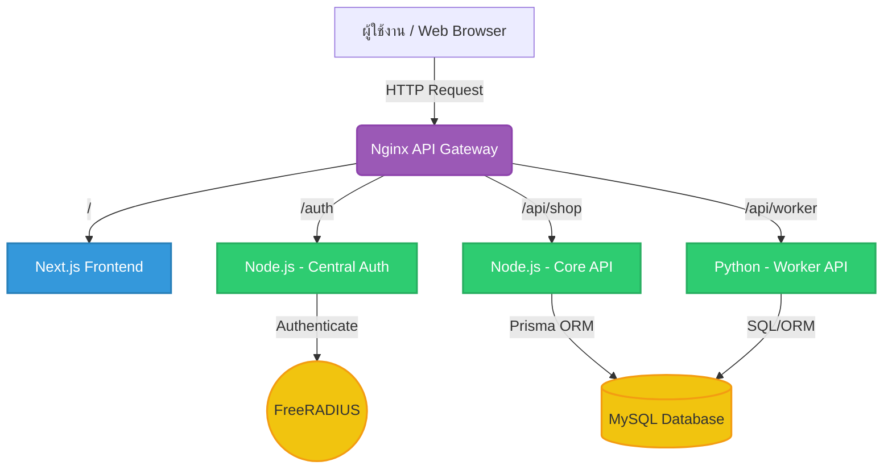

# สถาปัตยกรรมและการทำงานของระบบ E-Commerce (SSO Integrated)

เอกสารนี้อธิบายโครงสร้างและการทำงานแบบละเอียดของระบบร้านค้าออนไลน์ (E-Commerce) ที่บูรณาการร่วมกับระบบ Single Sign-On (SSO) เพื่อใช้ในการศึกษา

## 1. ภาพรวมของระบบ (System Architecture)

ระบบประกอบด้วย Microservices ย่อยที่ทำงานร่วมกันผ่าน **Nginx (Reverse Proxy)** โดยแต่ละ Service ถูกรันอยู่ใน Docker Container และสามารถสื่อสารกันผ่าน Docker Network (`kmitl_sso_net`)

---

## 2. หน้าที่ของแต่ละส่วนประกอบ (Components)

| Component | Technology | หน้าที่หลัก |
| :--- | :--- | :--- |
| **API Gateway** | Nginx | เป็นประตูแรกรับ Request จากผู้ใช้ และโยนไปให้ Service ที่ถูกต้องตาม Path |
| **Frontend** | Next.js | แสดงผลหน้าเว็บ (UI) ให้ผู้ใช้ เช่น หน้าร้านค้า หน้าตะกร้าสินค้า ดึงข้อมูลจาก API |
| **Central Auth** | Node.js | จัดการหน้า Login, ตรวจสอบรหัสผ่านกับ RADIUS และออก JWT Token ให้ผู้ใช้ |
| **RADIUS Server** | FreeRADIUS | เก็บข้อมูลและรับรองความถูกต้องของรหัสผ่านผู้ใช้งาน (Single Source of Truth) |
| **Core API** | Node.js + Prisma | ตรวจสอบ JWT Token, จัดการกระเป๋าเงิน (Credit), ทำรายการสั่งซื้อ (Transactions) |
| **Worker API** | Python | รันสคริปต์พื้นหลัง เช่น เช็คความถูกต้องของไอดีเกม, ดึงราคาตลาดอัปเดตแบบเรียลไทม์ |
| **Database** | MySQL | เก็บข้อมูลร้านค้า เช่น เครดิตผู้ใช้, รายการสินค้า, ประวัติการสั่งซื้อ และคลังไอดีเกม |

---

## 3. ขั้นตอนการทำงานแบบละเอียด (Workflows)

### Workflow 1: การเข้าสู่ระบบ (Single Sign-On Flow)
ระบบนี้ยึดหลัก **Single Source of Truth** หมายความว่าฐานข้อมูลร้านค้า (MySQL) จะไม่มีการเก็บรหัสผ่านผู้ใช้ไว้เลย

1. ผู้ใช้กดปุ่ม Login ที่หน้าเว็บ (Next.js)
2. ผู้ใช้ถูก Redirect ไปที่หน้า Login ของระบบ `central-auth` (ผ่านพาธ `/auth`)
3. ผู้ใช้กรอก Username และ Password
4. `central-auth` นำข้อมูลไปตรวจสอบกับ **FreeRADIUS**
5. หากข้อมูลถูกต้อง `central-auth` จะสร้าง **JWT (JSON Web Token)** ที่เข้ารหัสข้อมูลผู้ใช้ (เช่น Username) ไว้ข้างใน
6. `central-auth` ส่ง JWT กลับไปที่เบราว์เซอร์ (มักจะเก็บใน HTTP-Only Cookie) และ Redirect กลับไปหน้าหลัก (Next.js)
7. ครั้งต่อไปที่ Next.js ร้องขอข้อมูล จะส่ง Cookie ที่มี JWT ไปด้วยเสมอ

### Workflow 2: การสั่งซื้อไอดีเกม (Transaction Flow)
1. ผู้ใช้เลือกไอดีเกมที่หน้าเว็บ Next.js และกด "สั่งซื้อ"
2. Next.js ยิง API Request ไปที่ `/api/shop/orders` (วิ่งเข้าหา Node.js Core API) พร้อมกับ JWT
3. **Core API** (Node.js) ตรวจสอบความถูกต้องของ JWT ว่าไม่ได้ถูกปลอมแปลง
4. Core API คุยกับ MySQL ผ่าน Prisma ORM เพื่อ:
   - ตรวจสอบยอด Credit Balance ว่ามีพอหรือไม่
   - ถ้าพอ -> ทำการ **หักเครดิต** และ **สร้าง Order** (ทำใน Transaction เดียวกัน)
   - นำ Game ID ออกจากคลังสินค้า (Stock) และย้ายไปใส่ใน `UserInventory` ของผู้ใช้คนนั้น
5. Core API ตอบกลับ Next.js ว่าการสั่งซื้อสำเร็จ
6. Next.js รีเฟรชหน้าเพื่ออัปเดตยอดเงินคงเหลือและคลังสินค้าส่วนตัว

### Workflow 3: ระบบทำงานเบื้องหลัง (Background Worker Flow)
ระบบ E-Commerce ไอดีเกมมักต้องการการตรวจสอบรหัสผ่านเกมอัตโนมัติ เพื่อยืนยันว่าไอดีที่ขายใช้งานได้จริง
1. แอดมินนำไอดีเกมพร้อมพาสเวิร์ดเพิ่มเข้าไปในระบบ (ผ่าน Node.js) ข้อมูลจะไปเก็บใน `UserInventory` (สถานะยังไม่ยืนยัน)
2. **Python Worker** ที่รันอยู่เบื้องหลัง ดึงรายชื่อไอดีที่ต้องตรวจสอบจาก MySQL
3. Python ส่ง Request (Web Scraping / API อัตโนมัติ) ไปทดลองล็อกอินที่เซิร์ฟเวอร์เกมจริงๆ
4. หากสำเร็จ Python จะอัปเดตสถานะไอดีนั้นใน MySQL ว่า "พร้อมขาย"
5. *(ทางเลือก)* Python ดึงข้อมูลราคาไอเทมจากเว็บตลาดโลก และคำนวณอัปเดตฟิลด์ `price` ใน MySQL อัตโนมัติทุกๆ 1 ชั่วโมง

---

## 4. โครงสร้างฐานข้อมูล (Database Schema)

จัดการผ่าน **Prisma ORM** ใน Node.js เพื่อความปลอดภัยและทำงานร่วมกับ TypeScript ได้อย่างมีประสิทธิภาพ:
- `User`: เก็บแค่ `id`, `username` และยอดเงิน `credit_balance` (ไม่มีพาสเวิร์ด)
- `Product`: เก็บข้อมูล Game Pass ที่มีในระบบ
- `Order`: เก็บประวัติการซื้อ (Status: pending, completed, failed)
- `UserInventory`: คลังเก็บไอเทมหรือไอดีเกมพร้อมรหัสผ่าน ที่จะโอนกรรมสิทธิ์ให้ User เมื่อการสั่งซื้อสมบูรณ์
