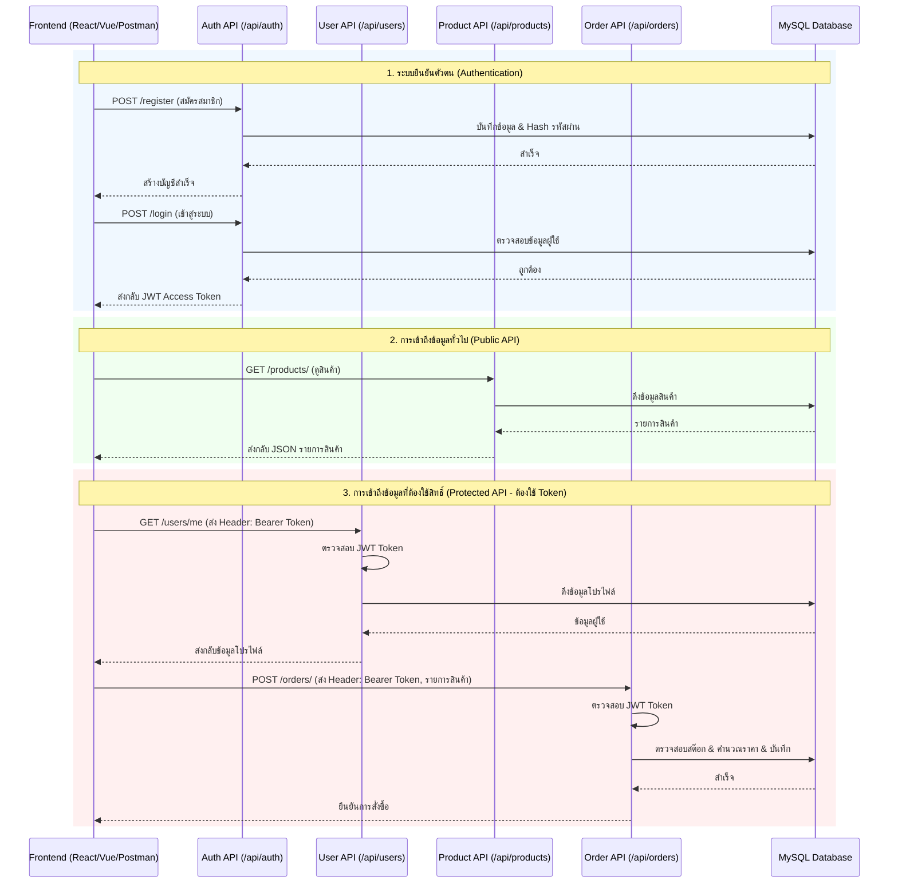

# คู่มือและสถาปัตยกรรมระบบ Backend (FastAPI + MySQL + Docker)

เอกสารนี้อธิบายการทำงานของระบบหลังบ้าน (Backend) สำหรับโปรเจกต์ E-Commerce & SSO Lab ซึ่งสอดคล้องกับเทคโนโลยีและโครงสร้างที่พัฒนาขึ้นจริง โดยครอบคลุมตั้งแต่การออกแบบไปจนถึงวิธีการนำ API ไปเชื่อมต่อกับ Frontend

---

## 1. ภาพรวมและเทคโนโลยีที่ใช้ (Tech Stack & Overview)
ระบบถูกออกแบบมาให้ทำงานในคอนเทนเนอร์ (Dockerized) เพื่อความสะดวกในการติดตั้งและทดสอบ
- **Framework หลัก:** `FastAPI` (Python) ทำงานแบบ Asynchronous รวดเร็ว และสร้างเอกสาร API ให้อัตโนมัติ
- **Database:** `MySQL 8.0` รันผ่าน Docker 
- **ORM:** `SQLAlchemy` สำหรับเชื่อมต่อและจัดการฐานข้อมูล
- **Data Validation:** `Pydantic` สำหรับตรวจสอบความถูกต้องของข้อมูล (Schemas)
- **Deployment:** `Docker` และ `Docker Compose`

### โครงสร้างโปรเจกต์ (Folder Structure)
- `app/models/`: กำหนดโครงสร้างตารางในฐานข้อมูล (SQLAlchemy Models)
- `app/schemas/`: กำหนดรูปแบบข้อมูลเข้า/ออกของ API (Pydantic Models)
- `app/crud/`: รวมฟังก์ชันคำสั่งดึง/เพิ่ม/แก้ไข/ลบ ข้อมูลใน Database (Create, Read, Update, Delete)
- `app/api/endpoints/`: ตัวรับ Request จากผู้ใช้ (Routers) สำหรับระบบต่างๆ เช่น Auth, Users, Products, Orders
- `app/core/`: ตั้งค่าระบบและ Security เช่น ไฟล์อ่าน `.env` และการสร้าง JWT Token
- `app/main.py`: จุดเริ่มต้นของแอปพลิเคชัน ตั้งค่า CORS และเชื่อม API ทั้งหมดเข้าด้วยกัน
- `docker-compose.yml` & `Dockerfile`: กำหนดการทำงานของเซิร์ฟเวอร์และฐานข้อมูล

### วิธีสตาร์ทระบบ (How to run Backend & Database)
เพื่อให้ระบบหลังบ้านและฐานข้อมูล (MySQL) พร้อมทำงานสำหรับเชื่อมต่อกับหน้าบ้าน (Frontend) ให้รันคำสั่งต่อไปนี้ใน Terminal (ต้องอยู่ในโฟลเดอร์ `backend-python`):

```bash
# คำสั่งสตาร์ทระบบ (รัน Backend และ Database ไว้เบื้องหลัง)
docker-compose up -d --build
```

หลังจากรันคำสั่งนี้:
- **Backend API** จะเปิดทำงานที่ `http://localhost:8000`
- **คู่มือ API (Swagger UI)** สามารถเข้าดูและทดสอบได้ที่ `http://localhost:8000/docs`
- **Database MySQL** จะเปิดใช้งานที่ Port `3307` ของเครื่อง (เผื่อให้โปรแกรมจัดการ DB เข้าถึงได้)

*(หากต้องการปิดการทำงานของระบบทั้งหมด ให้ใช้คำสั่ง `docker-compose down`)*

### Workflow การทำงานของระบบ (System Workflow)



---

## 2. การออกแบบฐานข้อมูล (Database Schema)
ฐานข้อมูลชื่อ `ecom_db` ประกอบด้วยตารางหลักดังนี้:
1. **users:** เก็บข้อมูลบัญชีผู้ใช้ (`id`, `username`, `email`, `password_hash`, `role` (admin/customer))
2. **products:** เก็บข้อมูลสินค้า (`id`, `name`, `description`, `price`, `stock`)
3. **orders:** เก็บข้อมูลใบสั่งซื้อ (`id`, `user_id`, `status`, `total_price`)
4. **order_items:** เก็บรายละเอียดสินค้าในใบสั่งซื้อ (`id`, `order_id`, `product_id`, `quantity`, `price`)

---

## 3. ระบบยืนยันตัวตนและความปลอดภัย (Authentication & Security)
- **Password Hashing:** รหัสผ่านผู้ใช้ทั้งหมดจะถูกเข้ารหัสผ่านด้วยอัลกอริทึม `bcrypt` ก่อนบันทึกลง Database
- **JWT (JSON Web Token):** เมื่อล็อกอินสำเร็จ ระบบจะคืนค่า Access Token ให้ Token นี้ใช้เป็นกุญแจผ่านทางสำหรับการเรียก API เส้นอื่นๆ
- **Role-Based Access Control:** มีการจำกัดสิทธิ์ในบาง API เช่น การเพิ่ม/ลบสินค้า หรือแก้ไขสถานะคำสั่งซื้อ จะต้องล็อกอินด้วยผู้ใช้ที่มี Role เป็น `admin` เท่านั้น

---

## 4. สรุป API Endpoints หลัก
- **Authentication:** 
  - `POST /api/auth/register` (สมัครสมาชิก)
  - `POST /api/auth/login` (เข้าสู่ระบบ เพื่อรับ Token)
- **Users:** 
  - `GET /api/users/me` (ดูโปรไฟล์ตัวเอง - ต้องใช้ Token)
- **Products:** 
  - `GET /api/products/` (ดูสินค้าทั้งหมด)
  - `POST /api/products/` (เพิ่มสินค้า - เฉพาะ Admin)
- **Orders:** 
  - `POST /api/orders/` (สร้างคำสั่งซื้อ จะมีการคำนวณราคาและตัดสต๊อกให้อัตโนมัติ - ต้องใช้ Token)
  - `GET /api/orders/my-orders` (ดูประวัติการสั่งซื้อของตนเอง)

---

## 5. การทดสอบระบบด้วย Postman (และ Swagger UI)
ด้วยความสามารถของ FastAPI ทำให้ระบบสร้างหน้า API Docs (Swagger UI) ให้ทดสอบได้ทันทีที่ `http://localhost:8000/docs`

**หากต้องการทดสอบด้วย Postman อย่างเต็มรูปแบบ:**
1. **Import API เข้า Postman อัตโนมัติ:**
   - เปิด Postman กดปุ่ม **Import**
   - ใส่ URL ของ OpenAPI Spec ลงไป: `http://localhost:8000/openapi.json`
   - Postman จะสร้าง Collection ชื่อ "E-Commerce API" ให้พร้อมใช้งาน
2. **การตั้งค่า Base URL:**
   - ไปที่แท็บ **Variables** ของ Collection
   - ตั้งค่าตัวแปร `baseUrl` ให้มีค่าเป็น `http://localhost:8000`
3. **Flow การทดสอบจริง:**
   - ยิง `POST /api/auth/register` เพื่อสร้าง User
   - ยิง `POST /api/auth/login` แบบ `x-www-form-urlencoded` กรอก username/password แล้วก๊อปปี้ `access_token` จากผลลัพธ์
   - กลับไปที่หน้าหลักของ Collection เลือกแท็บ **Authorization** เปลี่ยน Type เป็น **Bearer Token** แล้ววาง `access_token` ลงไป
   - เริ่มกดยิงทดสอบ API เส้นอื่นๆ เช่น ซื้อของ หรือ ดูโปรไฟล์ ได้ทันที

---

## 6. การเชื่อมต่อกับ Frontend (Frontend Integration Guide)
ระบบ Backend ถูกเตรียมความพร้อมสำหรับการนำไปต่อกับ Frontend (ไม่ว่าจะเป็น React, Vue, HTML ธรรมดา) ไว้เรียบร้อยแล้ว:

### 1. การแก้ไขปัญหา CORS
ในไฟล์ `app/main.py` มีการตั้งค่า `CORSMiddleware` ซึ่งอนุญาตให้โดเมนอื่น (เช่น `http://localhost:3000` ของ React) สามารถยิง Request ข้ามโดเมนมาดึงข้อมูลที่ Backend ได้โดยไม่ถูกเบราว์เซอร์บล็อก

### 2. วิธีการส่ง Request จาก Frontend
**การเรียก API สาธารณะ (เช่น ดูสินค้า):**
Frontend สามารถใช้ `fetch()` หรือ `axios` ยิงดึงข้อมูลปกติได้เลย
```javascript
fetch("http://localhost:8000/api/products/")
  .then(res => res.json())
  .then(data => console.log(data));
```

**การเรียก API ที่ต้องล็อกอิน (เช่น การสั่งซื้อ หรือ ดูโปรไฟล์):**
Frontend จะต้องเก็บ JWT Token ที่ได้ตอนล็อกอิน (มักเก็บใน LocalStorage หรือ SessionStorage) และทุกครั้งที่จะยิง API ให้แนบ Token ไปใน **Headers** ผ่านฟิลด์ `Authorization` ดังนี้:

```javascript
const token = localStorage.getItem("access_token");

fetch("http://localhost:8000/api/users/me", {
  method: "GET",
  headers: {
    "Authorization": `Bearer ${token}`, // แนบ Token ไปด้วยรูปแบบ "Bearer <token>"
    "Content-Type": "application/json"
  }
})
```

---
*เอกสารฉบับนี้อัปเดตล่าสุดตามระบบที่ทำงานจริงใน Environment ของ Docker*
