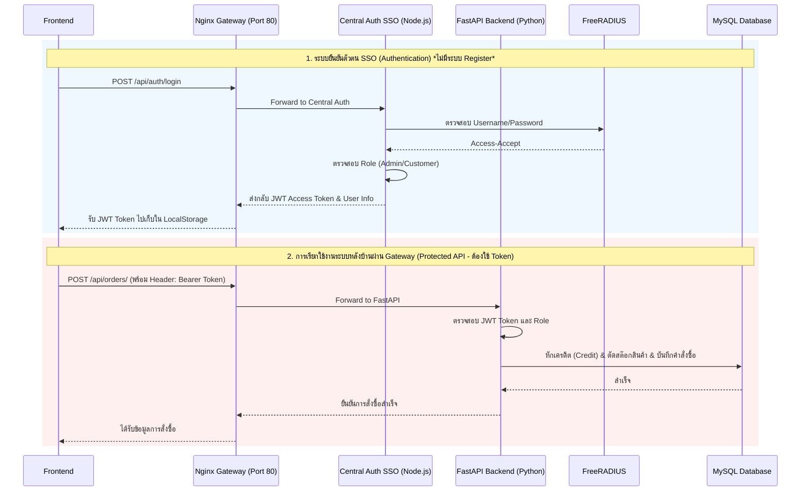

# คู่มือและสถาปัตยกรรมระบบ Backend (FastAPI + Node.js + MySQL + Nginx)

เอกสารนี้อธิบายการทำงานของระบบหลังบ้าน (Backend) สำหรับโปรเจกต์ E-Commerce & SSO Lab ซึ่งสอดคล้องกับเทคโนโลยีและโครงสร้างที่พัฒนาขึ้นจริง โดยครอบคลุมตั้งแต่การออกแบบสถาปัตยกรรมแบบ Single Sign-On (SSO) ไปจนถึงวิธีการนำ API ไปเชื่อมต่อกับ Frontend ผ่าน Nginx Gateway

---

## 1. ภาพรวมและเทคโนโลยีที่ใช้ (Tech Stack & Overview)
ระบบถูกออกแบบมาให้ทำงานในคอนเทนเนอร์ (Dockerized) และมี Nginx เป็น API Gateway หรือประตูเดียวสำหรับรับส่งข้อมูลทั้งหมดในระบบ:
- **API Gateway:** `Nginx` ทำหน้าที่รับ Request จาก Frontend และกระจายไปยัง Service ที่เกี่ยวข้อง
- **SSO Central Auth:** `Node.js` (Express) ทำหน้าที่ตรวจสอบสิทธิ์ผู้ใช้กับ FreeRADIUS และออก JWT Token ให้ผู้ใช้
- **Resource Server (Backend):** `FastAPI` (Python) จัดการข้อมูลระบบ E-Commerce (สินค้า, คำสั่งซื้อ, เครดิต) ทำงานแบบ Asynchronous รวดเร็ว
- **Database:** `MySQL 8.0` รันผ่าน Docker
- **ORM:** `SQLAlchemy` สำหรับเชื่อมต่อและจัดการฐานข้อมูล
- **Data Validation:** `Pydantic` สำหรับตรวจสอบความถูกต้องของข้อมูล (Schemas)
- **Deployment:** `Docker` และ `Docker Compose`

### โครงสร้างโปรเจกต์ (Folder Structure)
- `nginx/`: การตั้งค่า Nginx Gateway
- `central-auth/`: ระบบจัดการการล็อกอินแบบ SSO (เชื่อมต่อกับ FreeRADIUS)
- `backend-python/app/models/`: กำหนดโครงสร้างตารางในฐานข้อมูล (SQLAlchemy Models)
- `backend-python/app/schemas/`: กำหนดรูปแบบข้อมูลเข้า/ออกของ API (Pydantic Models)
- `backend-python/app/crud/`: รวมฟังก์ชันคำสั่งดึง/เพิ่ม/แก้ไข/ลบ ข้อมูลใน Database (Create, Read, Update, Delete)
- `backend-python/app/api/endpoints/`: ตัวรับ Request จากผู้ใช้ (Routers) สำหรับระบบต่างๆ เช่น Users, Products, Orders
- `backend-python/app/core/`: ตั้งค่าระบบและ Security เช่น ไฟล์อ่าน `.env`
- `backend-python/app/main.py`: จุดเริ่มต้นของแอปพลิเคชัน FastAPI ตั้งค่า CORS และเชื่อม API ทั้งหมดเข้าด้วยกัน
- `docker-compose.yml`: กำหนดการทำงานของเซิร์ฟเวอร์ทั้งหมดในระบบ

### วิธีสตาร์ทระบบ (How to run)
เพื่อให้ระบบทั้งหมดพร้อมทำงาน ให้รันคำสั่งต่อไปนี้ใน Terminal ที่ Root Directory ของโปรเจกต์:

```bash
# คำสั่งสตาร์ทระบบ (รัน Nginx, Central Auth, Backend, FreeRADIUS, MySQL ไว้เบื้องหลัง)
docker-compose up -d --build
```

หลังจากรันคำสั่งนี้:
- **ระบบผ่าน Nginx (ประตูเดียว):** จะเปิดทำงานที่ `http://localhost` (Port 80)
- **คู่มือ API (Swagger UI ของ FastAPI):** เข้าดูได้ที่ `http://localhost:8000/docs` (สำหรับการพัฒนา)
- Frontend จะต้องเรียก API ทั้งหมดผ่าน **`http://localhost/api/...`** เท่านั้น ห้ามเรียกไปที่ Port 8000 หรือ Port 3000 ของ Central Auth โดยตรง เพื่อให้เป็นไปตามหลักการ SSO และ Gateway

### Workflow การทำงานของระบบ (System Workflow)



---

## 2. การออกแบบฐานข้อมูล (Database Schema)
ฐานข้อมูลชื่อ `ecom_db` ประกอบด้วยตารางหลักดังนี้:
1. **users:** เก็บข้อมูลบัญชีผู้ใช้เมื่อล็อกอินสำเร็จ (`id`, `username`, `email`, `role`, `credit_balance`)
2. **products:** เก็บข้อมูลสินค้า (`id`, `name`, `description`, `price`, `stock`, `category`, `image`)
3. **orders:** เก็บข้อมูลใบสั่งซื้อ (`id`, `user_id`, `status`, `total_price`)
4. **order_items:** เก็บรายละเอียดสินค้าในใบสั่งซื้อ (`id`, `order_id`, `product_id`, `quantity`, `price`)

---

## 3. ระบบยืนยันตัวตนและความปลอดภัย (SSO Authentication & Security)
- **Single Source of Truth:** ระบบไม่มี API สำหรับสมัครสมาชิก (Register) ผู้ใช้ทั้งหมดจะถูกจัดการผ่านระบบส่วนกลาง (เช่น FreeRADIUS) การล็อกอินเป็นการยืนยันสิทธิ์จากระบบส่วนกลางเท่านั้น
- **JWT (JSON Web Token):** Central Auth จะเป็นผู้ออก Access Token ที่มีข้อมูล Username และ Role (สิทธิ์การใช้งาน) Token นี้ใช้เป็นกุญแจผ่านทางสำหรับการเรียก FastAPI เส้นอื่นๆ
- **Role-Based Access Control (RBAC):** มีการจำกัดสิทธิ์ใน FastAPI โดยอ่านข้อมูล Role จาก JWT Token:
  - ผู้ใช้ที่มี Role `admin` เท่านั้น ที่จะสามารถเข้าถึง API สำหรับจัดการสินค้า (เพิ่ม, ลบ) ได้
  - ผู้ใช้ทั่วไปสามารถเข้าถึงการซื้อสินค้า, เติมเงินเครดิต และดูประวัติการสั่งซื้อได้
- **เครดิตระบบ (Credit System):** การซื้อสินค้าจะใช้วิธีหักเครดิตจากบัญชีผู้ใช้ (`credit_balance`) หากเครดิตไม่พอจะไม่สามารถซื้อสินค้าได้

---

## 4. สรุป API Endpoints หลักผ่าน Nginx
Frontend ต้องเรียก API เหล่านี้ผ่าน Base URL: `http://localhost`

- **Authentication (ผ่าน Central Auth):** 
  - `POST /api/auth/login` (เข้าสู่ระบบ เพื่อรับ JWT Token จาก FreeRADIUS) *ไม่มีการ Register*

- **Users (ผ่าน FastAPI):** 
  - `GET /api/users/me` (ดูโปรไฟล์ตัวเองและเครดิต - ต้องใช้ Token)
  - `POST /api/users/topup` (เติมเครดิตเข้าบัญชี - ต้องใช้ Token)

- **Products (ผ่าน FastAPI):** 
  - `GET /api/products/` (ดูสินค้าทั้งหมด)
  - `POST /api/products/` (เพิ่มสินค้า - เฉพาะ Admin)
  - `DELETE /api/products/{product_id}` (ลบสินค้า - เฉพาะ Admin)

- **Orders (ผ่าน FastAPI):** 
  - `POST /api/orders/` (สร้างคำสั่งซื้อ จะมีการคำนวณราคา ตัดเครดิต และตัดสต๊อกให้อัตโนมัติ - ต้องใช้ Token)
  - `GET /api/orders/my-orders` (ดูประวัติการสั่งซื้อของตนเอง)

---

## 5. การเชื่อมต่อกับ Frontend (Frontend Integration Guide)
ระบบออกแบบให้ทำงานเป็นระบบประตูเดียว (Nginx API Gateway) เพื่อให้ Frontend ใช้งานง่ายและมีความปลอดภัยสูง:

### วิธีการส่ง Request จาก Frontend
**การเรียก API สาธารณะ (เช่น ดูสินค้า):**
Frontend สามารถยิงดึงข้อมูลผ่าน Nginx (Port 80) ปกติได้เลย
```javascript
fetch("http://localhost/api/products/")
  .then(res => res.json())
  .then(data => console.log(data));
```

**การเรียก API ที่ต้องล็อกอิน (เช่น การสั่งซื้อ ดูโปรไฟล์ หรือเติมเงิน):**
Frontend จะต้องเก็บ JWT Token ที่ได้จาก `/api/auth/login` (มักเก็บใน LocalStorage หรือ SessionStorage) และทุกครั้งที่จะยิง API ให้แนบ Token ไปใน **Headers** ผ่านฟิลด์ `Authorization` ดังนี้:

```javascript
const token = localStorage.getItem("access_token");

fetch("http://localhost/api/users/me", {
  method: "GET",
  headers: {
    "Authorization": `Bearer ${token}`, // แนบ Token ไปด้วยรูปแบบ "Bearer <token>"
    "Content-Type": "application/json"
  }
})
```

---
*เอกสารฉบับนี้อัปเดตล่าสุดสอดคล้องกับสถาปัตยกรรม SSO และ Nginx Gateway ที่ทำงานจริงในโปรเจกต์*
